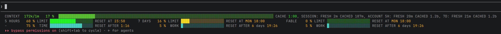
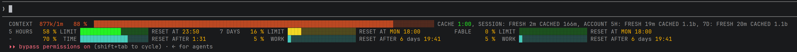

# A ready-made `.claude/` folder for your projects

Everything [Claude Code](https://claude.com/claude-code) picks up from a repository, in one folder
you copy into a project:

- a **status line** that shows how much of your Claude subscription you have used, and gives the
  model the same numbers;
- a **session log** that records what actually happened in each session;
- a **sound** when Claude finishes or needs you;
- **nine rules** that shape how the model works — when to stop and ask, what "finished" means, how to
  report back;
- a **reviewer** that checks every change without knowing what its author meant it to do;
- a **guide to writing prompts**, which Claude opens only when a task needs it.

There is nothing to install — no Node, no Python, no Go. The hooks are small ready-built programs for
macOS, Linux and Windows, and everything else is plain text.



## Your usage limits, always in view

A Claude subscription has several limits running at once: a **5-hour window**, a **weekly window**,
and for some models a **weekly allowance of their own**. Every Claude session you have open draws
from the same limits. Claude Code shows them when you type `/usage`, but the model — the one deciding
how much work to take on — never sees them. So you either stop early to be safe, or run into the wall
in the middle of something.

This hook keeps the numbers in front of both of you.

### Reading the status line

Each limit is a pair of bars:

- **LIMIT** — how much of it you have spent;
- **TIME** — how much of the window has passed. The weekly limits say **WORK** instead, because they
  count working hours (more on that below).

**When the top bar is ahead of the bottom one, you are spending faster than time is passing**, and the
limit will run out before it resets. The colour tells you the same at a glance: green while spending
keeps pace with time, then yellow, then red once it is 20 points ahead. **RESET AT** is when the limit
resets, and **RESET AFTER** is how long that is from now.

**The weekly bars count working hours, not calendar hours.** Nobody spends budget at four in the
morning, and weekends use little of it — so a calendar bar ran ahead of the spend every Monday and
fell behind it every Friday. You set which hours you work, and how much each day counts, in the
settings file.

The top line is about this session:

- **CONTEXT** — how full the conversation is. This is not a subscription limit; it is why a long
  session eventually gets compacted. It turns from green to red as it fills.
- **CACHE** — how long the prompt cache stays warm. Once it runs out, the next message costs more,
  because the whole conversation has to be cached again.
- **SESSION** and **ACCOUNT** — the tokens this session has used, and those of every session on this
  computer in the 5-hour and weekly windows. **FRESH** is new work. **CACHED** is the conversation
  being read back from the cache on every message; it costs a tenth as much, which is why the number
  gets so large.

Late in a long session the CONTEXT bar turns red. The limits keep their own colours, because those
follow your pace rather than how full they are:



### What the model sees

Before each of your messages, the model gets the same numbers as a short block of data — just the
figures, no bars:

```xml
<usage_limits scope="account-global: every session on this subscription" format="tokens in k/m/b; clock times local; waits h:mm">
<context used="867k of 1m (87%)"/>
<limit name="5-hour" used="58%" gone="70% of the window" resets="23:50, in 1:31"/>
<limit name="7-day" used="16%" gone="5% of the working week" resets="MON 18:00, in 6 days 19:41"/>
<limit name="Fable weekly bucket" used="0%" gone="5% of the working week" resets="MON 18:00, in 6 days 19:41"/>
<tokens session="fresh 2m, cached 164m" account_5h="fresh 19m, cached 1.1b" account_7d="fresh 20m, cached 1.1b"/>
<burn rate="0.16%/min, sampled" forecast="lasts to the reset at 23:50" pace="0.8"/>
<zone level="YELLOW" limiter="session">be lean: max 2 parallel subagents, no heavy fan-outs, avoid re-reads.</zone>
</usage_limits>
```

Numbers alone change nothing. The **session-budget** rule is what makes the model act on them: match
the effort to the task rather than to what is left, and stop short of a limit instead of running into
it. The last line — the **zone**, from GREEN to RED — says how tight things are.

### A brake near the limit

Extra agents are the fastest way to burn through a budget, so when a limit is nearly used up the hook
steps in: in the ORANGE zone it asks you once per session before the model launches one, and in the
RED zone it refuses. The reviewer is always let through.

## A log of every session

Ask a model what it did and you get a story it wrote about itself. This hook keeps the record
instead, straight from what Claude Code reports: your messages, the answers you picked when it asked
you something, which model worked and for how long, which files changed and on which lines, and the
final answer. There is one file per session in `management/logs/`, sorted by person and by day.

## A sound when it needs you

A short sound when Claude finishes, fails, or is waiting for you, so you can look away while it works.
To change it, replace `.claude/sounds/notify.wav` with any WAV file.

## The rules

Nine documents in `.claude/rules/` that Claude Code reads at the start of every session. They change
how the model works, not what it can see:

| Rule                         | In one line                                                                                 |
| ---------------------------- | ------------------------------------------------------------------------------------------- |
| **session-budget**           | Spend in proportion to the task; a limit is a wall to stop short of, not a budget to fill   |
| **before-starting-work**     | Bring the branch up to date and read what came in before doing anything else                |
| **working-autonomously**     | Carry a task to the end instead of handing it back half done                                |
| **architectural-forks**      | Decisions that are expensive to undo go to you first, with the options and a recommendation |
| **code-quality**             | Fix the cause, not the symptom — and when a model misbehaves, fix what it was given         |
| **finishing-work**           | Check, run and review every change before the turn ends; never commit unless asked          |
| **merge-conflicts**          | Resolve conflicts by hand, understanding both sides; never force anything                   |
| **response-style**           | Answer in your language, in plain words, with a short report after every piece of work      |
| **web-search-when-in-doubt** | When something behaves unexpectedly, check the current documentation before the next fix    |

The rules refer to each other by name, so **take them as a set**. Read them before installing: they
apply from the next session on, and every session carries them in its context.

## The reviewer

`change-reviewer` checks a change **without being told what its author intended** — it gets only the
change and the requirement. An author reads code as what they meant; a reviewer who sees only the code
sees what it actually does. It is told to try to break the change, it runs the code, and it cannot
edit anything. The finishing-work rule runs it once at the end of every change.

## The prompt-writing guide

`dev-ai-prompt-generation` is a guide to writing prompts, skills, rules and `CLAUDE.md` files: a short
overview plus 30 topic files. Unlike a rule, it costs nothing until it is used — Claude opens it only
when a task calls for it.

## Installing

The easiest way: open Claude Code in your project and ask it to install this repository, pointing it
at [AGENTS.md](AGENTS.md). That file takes it through every step, including the two that are easy to
miss on Windows, and a check that the install worked.

By hand, copy the folders across:

```sh
mkdir -p <project>/.claude <project>/scripts
cp -r .claude/hooks .claude/sounds .claude/usage-limits-config.json <project>/.claude/
cp -r scripts/usage-limits-* scripts/work-audit-* scripts/play-sound-* <project>/scripts/
cp -r .claude/rules .claude/agents .claude/skills <project>/.claude/   # the rules, the reviewer, the guide
```

Then merge `.claude/settings.json` into the project's own, or copy it if the project has none. Copy
`.gitattributes` too, and if you commit from Windows, mark the hooks executable — the command is in
[REFERENCE.md](REFERENCE.md#installing-this-in-another-project). Without these, the hooks quietly do
nothing for anyone working on a Mac or Linux.

## Settings you might want to change

They live in `.claude/usage-limits-config.json`:

| Setting               | What it changes                                                                  |
| --------------------- | -------------------------------------------------------------------------------- |
| `working_week`        | Which hours you work each day, and how much each day counts                      |
| `time_zone`           | The time zone your working day is in                                             |
| `zones`               | The percentages at which the zones turn YELLOW, ORANGE and RED                   |
| `limit_ahead_red_pct` | How far spending may run ahead of time before a bar is fully red (20 by default) |
| `gate_enabled`        | `false` keeps the display but never stops the model from launching agents        |
| `fetch_ttl_sec`       | How often your usage is fetched, in seconds (every minute by default)            |

If the hook cannot use a value, it says so on a `CONFIG` line under the bars and carries on with the
rest of the file.

## What the hooks never do

- **Break a session.** If anything goes wrong — no network, a broken setting, a missing file — they
  step aside quietly.
- **Send your data anywhere.** The only request they make is asking Anthropic for your own usage,
  with the login Claude Code already has. No API key is needed.
- **Keep much.** Three small files in your Claude folder — the usage figures, a note that the brake
  has asked, and token counts, never what your sessions said — plus the session log in the project.

## Requirements

Claude Code, signed in. The hooks run on macOS (Apple Silicon), Linux (x86-64) and Windows (x86-64).
For anything else, such as an Intel Mac or an ARM Linux machine, you can build them yourself —
[REFERENCE.md](REFERENCE.md#requirements) shows how.

## More detail

[REFERENCE.md](REFERENCE.md) describes everything in full: every part of the status line and of the
model's block, how working time is counted, every setting and what the hook checks in it, what the
session log records, which hook runs on which Claude Code event, and how to build from source.
[AGENTS.md](AGENTS.md) is the install procedure.
